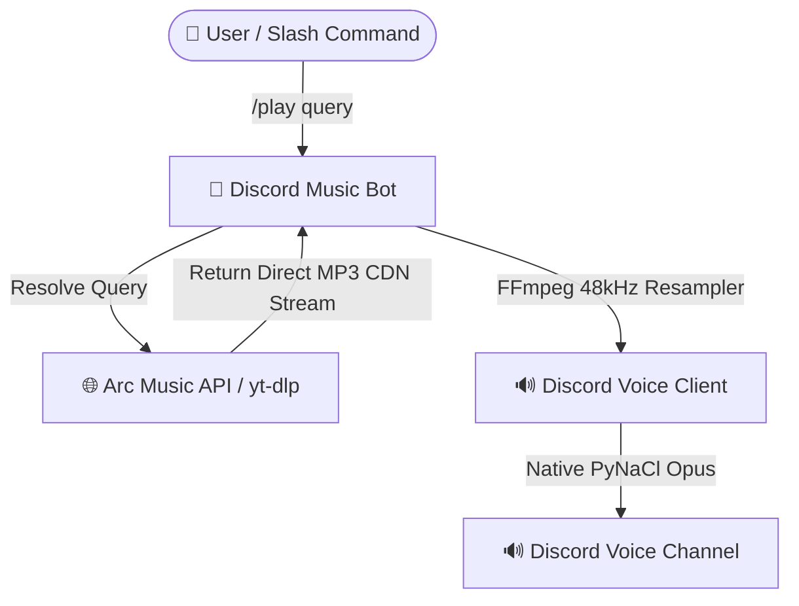

<div align="center">

  <h1>🎵 MusicForDiscord</h1>
  <p><b>A modern, high-fidelity, zero-dependency Discord Music Bot powered by native <code>discord.py</code> & Arc Music API.</b></p>

  <p>
    <a href="https://python.org"></a>
    <a href="https://github.com/Rapptz/discord.py"></a>
    <a href="https://ffmpeg.org"></a>
    <a href="https://huggingface.co"></a>
    <a href="https://render.com"></a>
    <a href="./LICENSE"></a>
  </p>

  <p>⚡ <b>No Java. No Lavalink servers. No complex setup.</b> Simply clone, configure your token, and stream high-quality audio seamlessly.</p>

  ---
</div>

## ✨ Key Features

- 🎧 **Native Streaming Architecture**: Streams high-bitrate audio directly using `discord.py` native voice and FFmpeg. Say goodbye to Lavalink crashes!
- 🎛️ **Interactive Controls UI**: Integrated Discord UI buttons (`Pause/Resume`, `Skip`, `Vol -`, `Vol +`, `Stop`) attached directly to the Now Playing card.
- 📊 **Real-Time Progress Bar**: Live progress tracking updated dynamically every 5 seconds.
- 🔊 **Dynamic Volume Boost**: Supports volume adjustments from `1%` up to `250%` with real-time gain normalization.
- 🚀 **Zero Latency Audio**: Resampled to native **48 kHz 16-bit Stereo PCM** with instant stream probing (`-probesize 32k`).
- 🖼️ **Rich Embeds & Metadata**: Automatic resolution of YouTube high-resolution thumbnails, durations, and Spotify queries via Arc API.
- 🌐 **Built-in 24/7 Keep-Alive Server**: Includes an `aiohttp` HTTP health endpoint for free 24/7 hosting on Hugging Face Spaces or Render + UptimeRobot.

---

## 🎮 Command Reference

| Command | Description | Example |
| :--- | :--- | :--- |
| `/play <query>` | Plays a song from YouTube/Spotify URL or search terms | `/play lofi hip hop` |
| `/nowplaying` | Shows the currently playing track with interactive controls & progress bar | `/nowplaying` |
| `/pause` | Pauses playback | `/pause` |
| `/resume` | Resumes paused playback | `/resume` |
| `/skip` | Skips the current track | `/skip` |
| `/stop` | Stops playback, clears the queue, and disconnects | `/stop` |
| `/volume <1-250>` | Sets playback volume (1% to 250%) | `/volume 120` |
| `/queue [page]` | Displays the current queued tracks with pagination | `/queue 1` |
| `/clear` | Clears all pending tracks from the queue | `/clear` |

---

## 🏗️ Architecture



---

## 🚀 Quickstart & Local Setup

### Prerequisites
- **Python 3.10+**
- **FFmpeg** installed and added to your System PATH ([Download FFmpeg](https://ffmpeg.org/download.html))

### Installation

1. **Clone the repository**:
   ```bash
   git clone https://github.com/vedanthaha/MusicForDiscord.git
   cd MusicForDiscord
   ```

2. **Create a Virtual Environment**:
   ```bash
   python -m venv .venv
   # On Windows:
   .venv\Scripts\activate
   # On Linux/macOS:
   source .venv/bin/activate
   ```

3. **Install Dependencies**:
   ```bash
   pip install -r requirements.txt
   ```

4. **Configure Environment Variables**:
   Copy `.env.example` to `.env` and fill in your details:
   ```env
   DISCORD_TOKEN=your_discord_bot_token_here
   DEV_GUILD_ID=your_discord_server_id_here
   ARC_API_KEY=ARC999dbdbee7b15ad2874b77
   DEFAULT_VOLUME=100
   ```

5. **Start the Bot**:
   ```bash
   python bot.py
   ```

---

## ☁️ Free 24/7 Hosting Setup

### Option 1: Hugging Face Spaces (⭐ Recommended — No Credit Card)
1. Create a free account on [Hugging Face](https://huggingface.co).
2. Click **New Space** → Select SDK: **Docker** → Choose **Blank**.
3. Push or upload this repository to your Space.
4. Go to **Settings** → **Variables & Secrets**, and add:
   - `DISCORD_TOKEN`
   - `ARC_API_KEY`
   - `DEFAULT_VOLUME`
5. Your bot will run 24/7 for free with **16 GB RAM**!

### Option 2: Render + UptimeRobot
1. Create a free **Web Service** on [Render.com](https://render.com) using `Dockerfile.bot`.
2. Add your environment variables in Render Dashboard.
3. Copy your Render Web Service URL (`https://your-bot.onrender.com`).
4. Set up a free monitor on [UptimeRobot](https://uptimerobot.com) to ping `https://your-bot.onrender.com/health` every 5 minutes to keep it online 24/7!

---

## 🛠️ Built With

- [discord.py](https://github.com/Rapptz/discord.py) - Discord API wrapper for Python
- [FFmpeg](https://ffmpeg.org/) - Multimedia framework for audio decoding & filtering
- [Arc Music API](https://api.arcmusic.fun) - Audio query resolution engine
- [aiohttp](https://github.com/aio-libs/aiohttp) - Asynchronous HTTP server & client

---

## 📜 License

Distributed under the **MIT License**. See [`LICENSE`](./LICENSE) for more information.

<div align="center">
  <sub>Made with ❤️ for Discord Music lovers.</sub>
</div>
